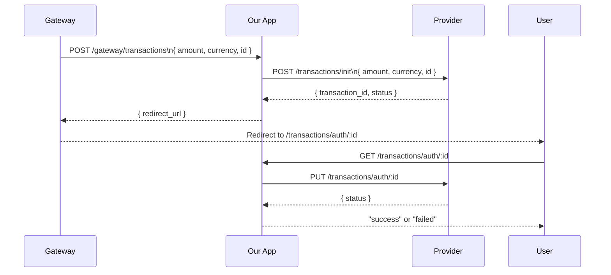

# Ruby on Rails Take-Home Test

A middleware application that bridges Gateway requests and Provider API calls for transaction processing. Implements two endpoints: a Gateway-facing init endpoint that returns redirect URLs, and a user-facing auth page that displays transaction status.

## Project Overview

This Rails application acts as middleware between a payment Gateway and an external Provider service. It handles transaction initialization requests from the Gateway, communicates with the Provider API, and presents a simple user-facing authentication page. The application exposes two main endpoints: `POST /gateway/transactions` for Gateway integration and `GET /transactions/auth/:id` for user authentication feedback.

## Transaction Flow



**Steps:**
1. Gateway sends transaction init request to `POST /gateway/transactions`
2. Our app forwards the request to Provider's init endpoint
3. Provider returns `transaction_id` and status
4. Our app constructs and returns a redirect URL to Gateway
5. User visits the redirect URL: `GET /transactions/auth/:id`
6. Our app calls Provider's auth endpoint
7. Based on Provider response, user sees "success" or "failed"

## Endpoints

### POST /gateway/transactions

Gateway-facing endpoint that initializes a transaction with the Provider.

**Request:**
```json
{
  "amount": 100,
  "currency": "EUR",
  "id": "txn_123"
}
```

**Success Response (200):**
```json
{
  "redirect_url": "https://our-app.test/transactions/auth/provider_txn_456"
}
```

**Error Responses:**
- `415` - Non-JSON Content-Type
- `422` - Missing required fields (amount, currency, id)
- `502` - Provider API error
- `504` - Provider timeout

### GET /transactions/auth/:id

User-facing page that displays transaction authentication result.

**Request:**
```
GET /transactions/auth/txn_abc123
```

**Success Response (200):**
```
success
```

**Failure Response (200):**
```
failed
```

Returns plain text "success" or "failed" based on Provider response. Always returns HTTP 200.

## Configuration

The application uses environment variables for configuration:

| Variable | Default | Description |
|----------|---------|-------------|
| `PROVIDER_BASE_URL` | `https://provider.example.com` | Base URL for Provider API |
| `APP_HOST` | `https://our-app.test` | Host used in redirect URLs |

### Setting Environment Variables

**PowerShell (Windows):**
```powershell
$env:PROVIDER_BASE_URL = "https://provider.example.com"
$env:APP_HOST = "https://our-app.test"
```

**Bash (Linux/macOS):**
```bash
export PROVIDER_BASE_URL="https://provider.example.com"
export APP_HOST="https://our-app.test"
```

**Using .env file (recommended):**
Create a `.env` file in the project root (note: add `.env.local` to `.gitignore` for secrets):
```
PROVIDER_BASE_URL=https://provider.example.com
APP_HOST=https://our-app.test
```

## Running Locally

### Setup

```bash
git clone https://github.com/Viktors-Vinogradovs/rails-test-task.git
cd "Ruby on Rails Test Task"
bundle install
bin/rails db:prepare
```

### Start Server

```bash
bin/rails server
```

Server starts at http://localhost:3000

### Run Tests

```bash
bundle exec rspec
```

For verbose output:
```bash
bundle exec rspec --format documentation
```

## Testing & Provider Stubbing

All Provider HTTP calls are stubbed in tests using **WebMock**. This ensures:

- ✅ Tests run without making real HTTP requests
- ✅ Tests are fast and deterministic
- ✅ Tests don't depend on external Provider availability
- ✅ Tests can simulate error scenarios (timeouts, 5xx errors, etc.)

### How It Works

WebMock is configured in `spec/rails_helper.rb` to block all external HTTP requests by default. Each test explicitly stubs the Provider API calls it needs.

### Example Test Stubs

See the request specs for examples:
- `spec/requests/gateway/transactions_spec.rb` - Gateway endpoint tests
- `spec/requests/transactions_auth_spec.rb` - Auth page tests

Example stub:
```ruby
stub_request(:post, "https://provider.example.com/transactions/init")
  .to_return(status: 200, body: { transaction_id: "txn_123", status: "pending" }.to_json)
```

## Testing with curl

⚠️ **Important:** `curl` commands against a running server will attempt **real HTTP requests** to `PROVIDER_BASE_URL` and will fail unless:
- A real Provider service is running at that URL, OR
- You have a mock server set up

**The intended verification method is running the test suite** (`bundle exec rspec`), which uses WebMock stubs.

If you want to test with curl, ensure you have a Provider running or mock server at `PROVIDER_BASE_URL`.

### Example curl Commands

**Init transaction:**
```bash
curl -X POST http://localhost:3000/gateway/transactions \
  -H "Content-Type: application/json" \
  -d '{"amount": 100, "currency": "EUR", "id": "txn_123"}'
```

**Auth page:**
```bash
curl http://localhost:3000/transactions/auth/txn_abc123
```

## Tech Stack

| Component | Version |
|-----------|---------|
| Ruby | 3.4.8 |
| Rails | 7.1.x |
| Database | SQLite |
| Testing | RSpec, WebMock |
| HTTP Client | Faraday |

## Useful Commands

```bash
bin/rails routes      # List all routes
bin/rails console     # Interactive Rails console
bin/rails db:migrate  # Run pending migrations
```
